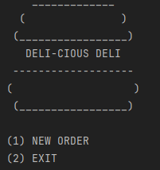
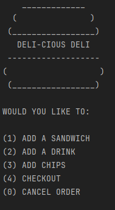
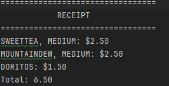
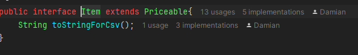
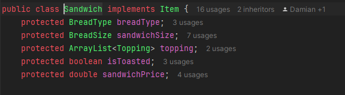
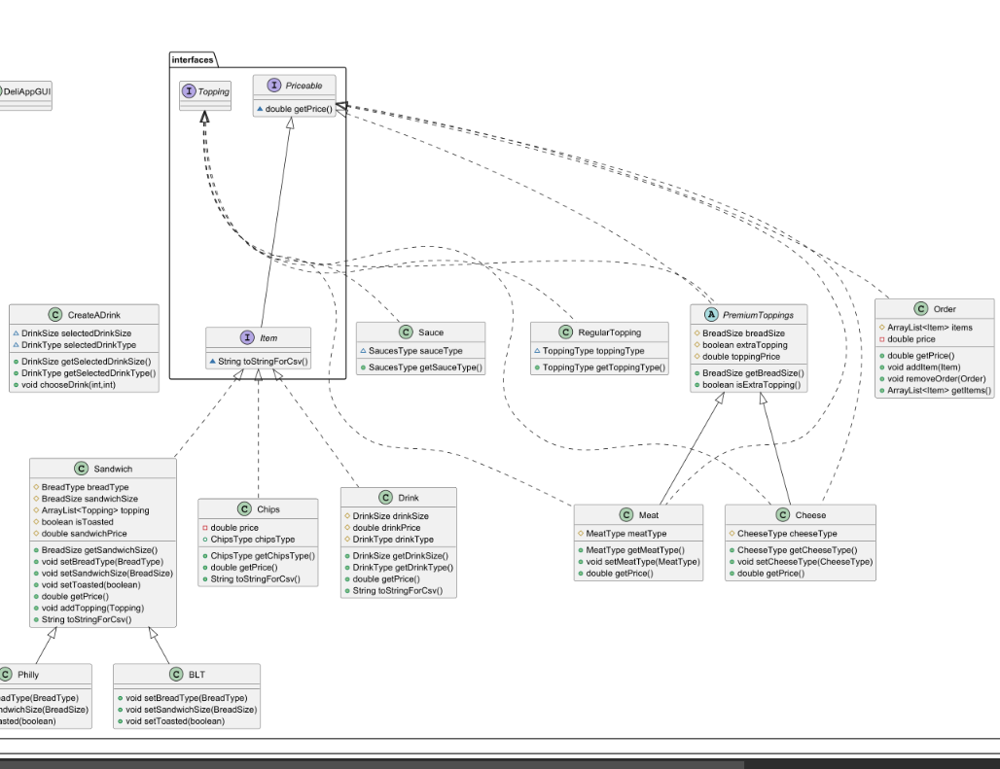
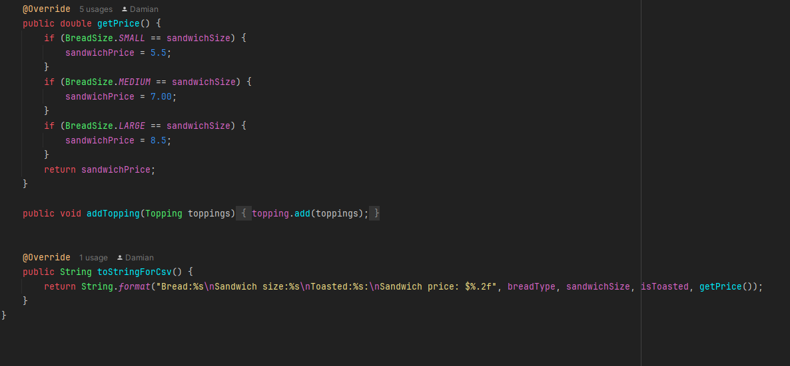
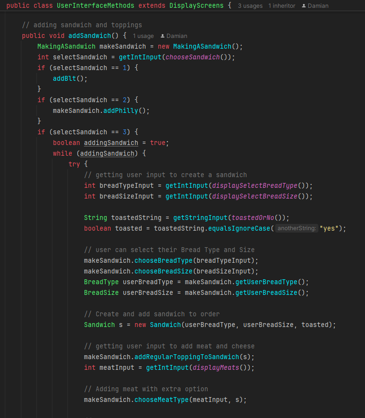
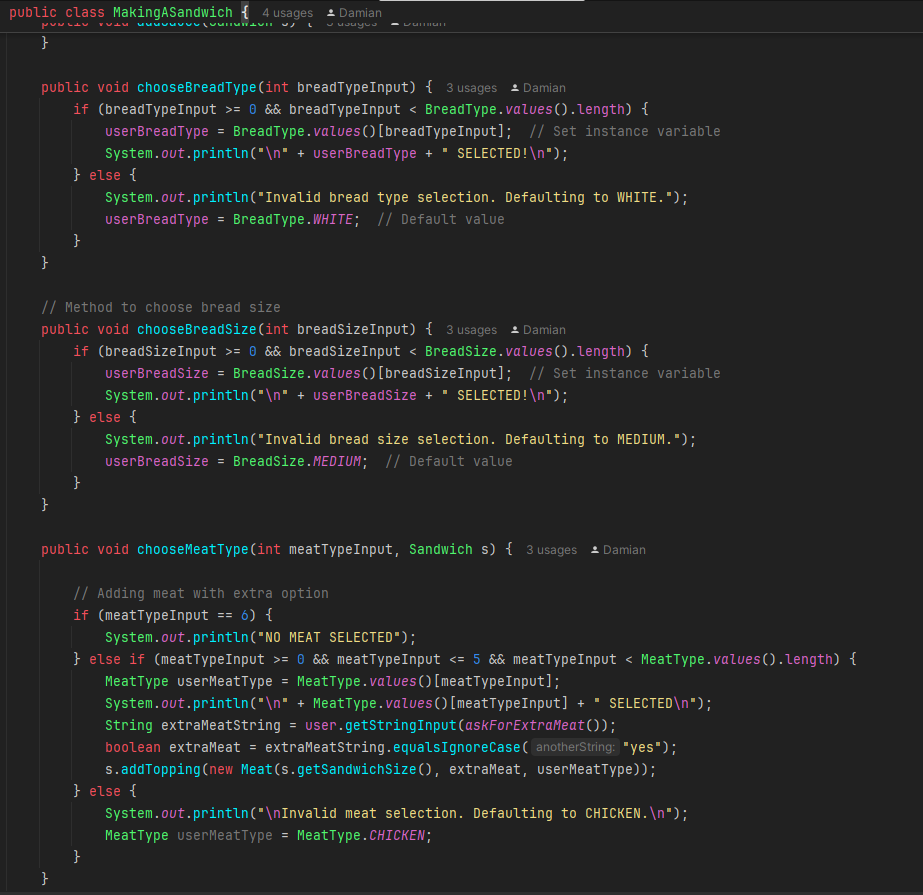
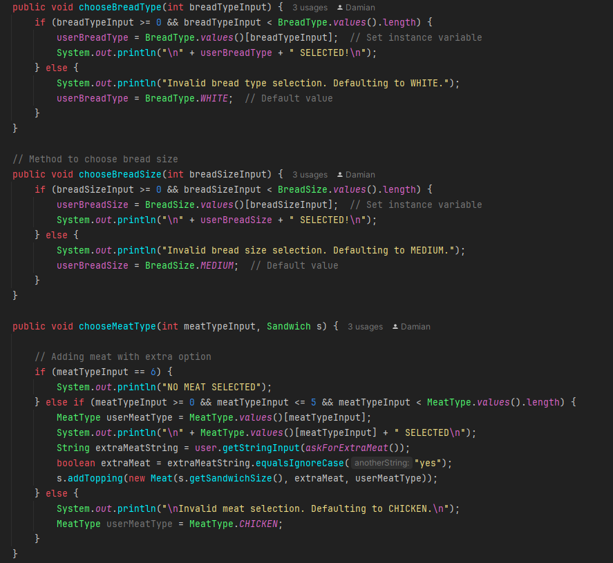

# DELI-CIOUS DELI

## wecome to the DELI-CIOUS deli 
when you first enter the program you are prompted with
the home screen where you can either go to the ordering
menu or if you change your mind you can exit the program

when the user selects "1" they are prompted with the order
screen where they can choose to order a sandwich, drink, or
chips.

when you select the make a sandwich option you can choose
from 2 signature sandwiches or you can you build your own. The BLT and the Philly Cheese 
Steak. Once you are done ordering you can check out and print your receipt 
into the receipt folder.

## Getting into the code of it all

if you change your mind, and you don't want to order anything
you can cancel your order and exit the program in the checkout screen
or on the ordering screen.

To make all this work I had to make an interface for Items so the program
know what items to add to the order and what to add to the sandwich toppings.
I also have another interface for the topping so the program know what items 
are actually considered toppings. and I have one more interface that tells the classes
that have a price to them. since all items have a price I extended my price interface to my 
items interface. so when I implement the items interface I don't have to 
also implement the pricable interface also.

### Here are some Examples

### here is a snippit of my UML that shows how the interfaces work

Also with the Items that implements the string so the Items can be written to the 
receipts nicely. and since the items interface extends pricable you can override the
getPrice() method.

## Organization 

The way I chose to organize my code was I have a user interface class the has my while loops that show the
display screen where the user can easily move between the screens. Then I have the user interface methods
class where I hold the methods for the user interface. Then I have another class where I hold the methods 
that help making a sandwich be more readable and holds the logic for the add sandwich method.

## Some things I have learned during this capstone

### enums

enums has made using immutable Strings so much easier to use. here are some example where I found using an enum easier

so here I was able to set values and validating using the users input so much easier using the enums. 
Another thing I learned was using interfaces and subclasses. It made defining class and using others classes
methods a lot easier and made understanding the code a lot easier. It also helped me with planning out my 
next steps on writing the code.